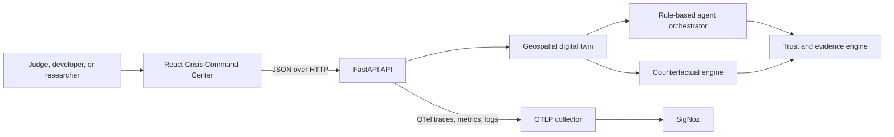

# GeoTwin Sentinel

> **Agentic Digital Twin for Healthcare Infrastructure Resilience**


[](LICENSE)


GeoTwin Sentinel is an observable agentic digital twin for exploring how a synthetic regional healthcare network responds to compound climate, infrastructure, cyber, and telemetry disruptions. A user selects a scenario, adjusts bounded conditions, and runs a deterministic simulation. The system evaluates hospital dependencies and capacity, coordinates specialized rule-based agents, proposes reviewable actions, compares counterfactual interventions, calculates evidence and trust indicators, and emits correlated OpenTelemetry traces, metrics, and logs for analysis in SigNoz.

> **Safety boundary:** GeoTwin Sentinel is a research decision-support prototype using synthetic data. Its outputs are simulated estimates intended for authorized human review and are not clinical, transfer, cybersecurity, infrastructure-control, or emergency-response instructions.

**Live demo:** Pending public deployment verification · **Demo video:** Pending recording · [Three-minute script](docs/demo/demo-script.md) · [Documentation map](docs/README.md) · [Limitations](docs/research/limitations.md)

## Why it exists

A regional disruption rarely stays in one system. Extreme weather can affect power, demand, referral capacity, cyber defenses, and the telemetry used to understand the event. A conventional dashboard reports signals; GeoTwin Sentinel runs a bounded synthetic experiment that connects those signals to a hospital dependency graph, records how each agent reached its recommendation, tests interventions against the same baseline, and makes uncertainty and human-review requirements visible.

## What is implemented

- Three deterministic compound-disruption scenarios and a five-hospital synthetic DFW catalog.
- A FastAPI digital-twin engine with hazard, demand, cyber-loss, dependency, capacity, risk, resilience, and transfer calculations.
- A React/TypeScript Crisis Command Center with MapLibre GIS, hospital details, accessible tabular fallbacks, and session run history.
- Compound Event Detector, Telemetry Integrity Agent, Resilience Planning Agent, and a Response Orchestrator record.
- Counterfactual intervention transformations, outcome comparison, hospital/transfer diffs, and user-adjustable ranking priorities.
- Versioned trust calculation, evidence inventory and lineage, policy checks, anomaly warnings, and explicit human review.
- OpenTelemetry traces, metrics, structured logs, trace correlation, and optional OTLP export to SigNoz.
- Container, Render, Vercel, CI, smoke-test, and production-configuration validation.

## Scenarios

| Scenario | Compound pressure | Best demo emphasis |
|---|---|---|
| [Flood Grid Cascade](docs/scenarios/flood-grid-cascade.md) | Flooding, grid outage, regional capacity pressure | Dependencies, backup power, transfers |
| [Heatwave Ransomware](docs/scenarios/heatwave-ransomware.md) | Heat/air quality, demand surge, ransomware | Overload, segmentation, surge capacity |
| [Wildfire + Telemetry Tampering](docs/scenarios/wildfire-telemetry-tampering.md) | Smoke, manipulated and missing telemetry | Trust degradation, verification, human review |

Wildfire + Telemetry Tampering is the primary judge demo because one run connects physical hazard, cyber evidence quality, security-agent behavior, trust policy, counterfactual telemetry verification, and a traceable execution path.

## How it works



The API loads packaged synthetic catalogs, evaluates a request without external data calls, and stores completed baselines in bounded process-local memory for trust and counterfactual lookup. The browser persists the latest synthetic completed run locally so command-center metrics survive refreshes. Restarting the API invalidates prior server-side simulation IDs. See [system architecture](docs/architecture/system-architecture.md), [data flow](docs/architecture/data-flow.md), and [deployment architecture](docs/architecture/deployment.md).

### Agent and trust workflow

The detector assesses compound pressure; the integrity agent constrains recommendations when evidence quality is low; the planning agent proposes bounded regional actions; and the response orchestrator assembles records for review. These are deterministic rule-based agents. The trust engine scores evidence completeness, telemetry integrity, geographic coverage, freshness, consistency, provenance, policy compliance, uncertainty, and agent reliability using calculation version `geotwin-trust-v2.0`. Lineage is metadata-based and is **not** cryptographic provenance. [Agent details](docs/architecture/agent-orchestration.md) · [Trust model](docs/architecture/trust-model.md)

### Counterfactual reasoning

The explorer reruns the same evaluator after bounded transformations such as network segmentation, backup power, surge capacity, ambulance rerouting, or telemetry verification. It compares outcomes to the stored baseline and ranks completed candidates. Changing ranking weights changes prioritization, not simulated outcomes. Results are model estimates, not validated causal effects. [Counterfactual API and model](docs/api/counterfactual-api.md)

### Observability

FastAPI requests, digital-twin execution, agents, trust evaluation, and counterfactual evaluation emit OpenTelemetry. The UI displays a simulation trace ID and can link to a configured read-only SigNoz dashboard. Export failure is fail-open: it should not block simulation, but it reduces auditability. [Observability guide](docs/architecture/observability.md) · [SigNoz setup](docs/guides/signoz-setup.md)

## Why SigNoz is Essential

SigNoz is the inspection layer for the agentic workflow, not a decorative final
screenshot. A judge can open one returned trace ID and see the API request,
`simulation.run`, facility impacts, the three real `agent.execute` spans, trust checks,
and counterfactual work. Agent duration and status expose the slowest or failed component;
correlated JSON logs explain integrity warnings and human-review triggers; bounded metrics
compare scenario latency, failures, review counts, and telemetry-integrity incidents.
This makes delayed recommendations and fallback behavior debuggable while keeping model
confidence, evidence quality, policy compliance, and human approval distinct. SigNoz
supports operational traceability; it does not prove that an AI recommendation is correct.
See the [verified Query Builder workflow, dashboards, and alerts](docs/signoz-query-guide.md).

## Technology

React 19, TypeScript, Vite, MapLibre GL, FastAPI, Pydantic, NetworkX, OpenTelemetry, pytest, Vitest, Ruff, Docker, Render, Vercel, and SigNoz.

## Demo workflow

1. Open **Command Center** and select a compound-disruption scenario.
2. Run the simulation and inspect regional risk, resilience, affected hospitals, transfers, and the GIS view.
3. Open **Agent Activity** to inspect agent status, duration, evidence, warnings, and recommendations.
4. Open **Counterfactuals** to compare bounded interventions against the exact current baseline.
5. Open **Trust & Evidence** to inspect evidence completeness, telemetry integrity, confidence, policy checks, and human-review triggers.
6. Copy the trace ID or open **SigNoz** to follow the execution across the API, simulation engine, agents, trust checks, logs, and metrics.

## Prerequisites

For native development:

- Git
- Python 3.11 or newer; Python 3.12 matches the container and CI
- Node.js 20 with npm

For the container workflow:

- Docker Desktop on Windows or macOS, or Docker Engine with the Compose plugin on Linux

Check the installed tools:

```bash
git --version
python --version
node --version
npm --version
docker --version
docker compose version
```

## Local setup

Clone the repository first:

```bash
git clone https://github.com/harshapriyag123/agentic-healthcare-digital-twi.git
cd agentic-healthcare-digital-twi
```

### macOS and Linux

Start the API:

```bash
python3 -m venv .venv
source .venv/bin/activate
python -m pip install --upgrade pip
python -m pip install -e '.[dev]'
cp apps/api/.env.example apps/api/.env
uvicorn app.main:app --app-dir apps/api --reload --host 127.0.0.1 --port 8000
```

In a second terminal, start the web application:

```bash
cd apps/web
npm ci
cp .env.example .env.local
npm run dev -- --host 127.0.0.1 --port 5173
```

### Windows PowerShell

Start the API:

```powershell
py -3.12 -m venv .venv
.\.venv\Scripts\Activate.ps1
python -m pip install --upgrade pip
python -m pip install -e ".[dev]"
Copy-Item apps/api/.env.example apps/api/.env
uvicorn app.main:app --app-dir apps/api --reload --host 127.0.0.1 --port 8000
```

If PowerShell blocks virtual-environment activation, run
`Set-ExecutionPolicy -Scope Process Bypass` in that terminal and activate again.

In a second PowerShell terminal:

```powershell
Set-Location apps/web
npm ci
Copy-Item .env.example .env.local
npm run dev -- --host 127.0.0.1 --port 5173
```

### Local URLs

| Component | URL |
|---|---|
| GeoTwin web application | `http://127.0.0.1:5173` |
| FastAPI health | `http://127.0.0.1:8000/api/v1/health` |
| FastAPI readiness | `http://127.0.0.1:8000/api/v1/ready` |
| API documentation, local mode only | `http://127.0.0.1:8000/docs` |
| Local SigNoz, when separately installed | `http://localhost:3301` |

The copied web example sets `VITE_API_BASE_URL` for the separate development servers. Run a scenario once to populate the Command Center; the latest synthetic result is stored in browser local storage so it survives navigation and refreshes.

## Docker setup

Docker Compose runs the complete GeoTwin web/API/collector topology on Windows,
macOS, and Linux. From the repository root:

```bash
cp .env.example .env
docker compose up --build
```

Windows PowerShell equivalent:

```powershell
Copy-Item .env.example .env
docker compose up --build
```

Open `http://127.0.0.1:8080`. The web image builds React and serves it through
Nginx, which proxies same-origin `/api` requests to the non-root FastAPI
container. The collector accepts OTLP on ports `4317` and `4318`.

Useful commands:

```bash
docker compose ps
docker compose logs -f api web otel-collector
docker compose down
```

If ports are already occupied, edit the copied `.env`:

```dotenv
WEB_PORT=18080
API_PORT=18000
OTEL_GRPC_PORT=14317
OTEL_HTTP_PORT=14318
OTEL_HEALTH_PORT=13134
```

Then open the configured web port. Compose includes an OpenTelemetry Collector,
not the complete SigNoz storage and UI. Follow the [SigNoz setup guide](docs/guides/signoz-setup.md)
to connect a local or hosted SigNoz destination.

## Configuration

Copy the scoped examples; never commit populated `.env` files.

- Backend: `APP_ENV`, `APP_VERSION`, `LOG_LEVEL`, `CORS_ALLOWED_ORIGINS`, `TRUSTED_HOSTS`, `MAX_REQUEST_BODY_BYTES`, `OTEL_ENABLED`, `OTEL_SERVICE_NAME`, `OTEL_EXPORTER_OTLP_ENDPOINT`, `OTEL_EXPORTER_OTLP_INSECURE`, `OTEL_EXPORTER_OTLP_HEADERS`, `OTEL_RESOURCE_ATTRIBUTES`.
- Browser-public: `VITE_APP_ENV`, `VITE_APP_VERSION`, `VITE_DEPLOYMENT_NAME`, `VITE_API_BASE_URL`, `VITE_MAP_STYLE_URL`, `VITE_SIGNOZ_APP_URL`, `VITE_SIGNOZ_DASHBOARD_URL`.

Only `VITE_*` values enter the browser bundle; they must never contain ingestion keys or secrets. See [configuration tables](docs/guides/local-development.md#environment-configuration).

## Run a simulation

```bash
curl --fail-with-body -X POST http://127.0.0.1:8000/api/v1/simulations/run \
  -H 'Content-Type: application/json' \
  --data @scenarios/wildfire-telemetry.json
```

Copy the returned `simulation_id` to query `/api/v1/trust/{simulation_id}` or submit a counterfactual comparison. Tested examples are in the [API overview](docs/api/overview.md).

With the API and a recording OTLP destination running, verify the full primary flow:

```bash
python scripts/verify_observability.py
```

## Test and validate

macOS and Linux:

```bash
source .venv/bin/activate
ruff check .
pytest
cd apps/web
npm run lint
npm run typecheck
npm test -- --run
npm run build
```

Windows PowerShell:

```powershell
.\.venv\Scripts\Activate.ps1
ruff check .
pytest
Set-Location apps/web
npm run lint
npm run typecheck
npm test -- --run
npm run build
```

Deployment smoke tests and external-service requirements are documented in [testing](docs/guides/testing.md). CI also scans common secret patterns and validates a non-root container. The [technical blog draft](docs/blog/observing-agentic-digital-twin-with-signoz.md), [submission copy](docs/hackathon-submission.md), and [submission checklist](docs/submission-checklist.md) are kept in the repository.

## Cloud setup

### Recommended free hackathon path: Render

The checked-in [Render Blueprint](render.yaml) defines:

- `geotwin-sentinel-web`: a free static React site
- `geotwin-sentinel-api`: a free Docker-based FastAPI service

Deployment steps:

1. Push a reviewed commit to GitHub. Do not commit `.env`, tokens, passwords, or OTLP headers.
2. In Render, select **New → Blueprint**, connect the GitHub repository, and use `render.yaml`.
3. Deploy the API and copy its public HTTPS origin.
4. Set frontend `VITE_API_BASE_URL` to that API origin.
5. Copy the frontend HTTPS origin into API `CORS_ALLOWED_ORIGINS`.
6. Keep API `TRUSTED_HOSTS=*.onrender.com`.
7. If using hosted SigNoz, store `OTEL_EXPORTER_OTLP_ENDPOINT` and secret `OTEL_EXPORTER_OTLP_HEADERS` only in Render's API environment.
8. Set `VITE_SIGNOZ_APP_URL` or `VITE_SIGNOZ_DASHBOARD_URL` only to a public HTTPS, access-appropriate SigNoz URL. A local `localhost:3301` URL cannot work for evaluators.
9. Redeploy both services and verify the frontend, `/api/v1/health`, `/api/v1/ready`, one complete simulation, trust lookup, counterfactual comparison, and trace receipt.

Render's free API can sleep after inactivity. Wake it before judging by opening
its health URL and allow time for a cold start.

### Alternative free path: Vercel

The repository also contains [vercel.json](vercel.json), which builds the React
SPA and routes `/api/*` to the packaged FastAPI Python function. Import the
GitHub repository into Vercel, keep the repository root as the project root, set
the public `VITE_*` configuration, and deploy. This is convenient for one URL,
but it does not deploy the Docker images or a SigNoz server.

GitHub Pages can host only static frontend files and cannot run this Python API.
For complete production variables, smoke tests, rollback, CORS, security headers,
and SigNoz export instructions, use the [cloud deployment guide](docs/guides/cloud-deployment.md),
[deployment and release guide](docs/DEPLOYMENT.md), and
[release checklist](docs/RELEASE_CHECKLIST.md).

## Repository map

```text
apps/api/       FastAPI routes, models, simulation, agents, trust, telemetry
apps/web/       React command center, GIS, agent, counterfactual, trust views
data/           Synthetic hospital GeoJSON catalog
scenarios/      Deterministic synthetic scenario request documents
observability/  Local OpenTelemetry Collector configuration
tests/          Backend unit and API integration tests
docs/           Demo, architecture, API, guides, scenarios, and research docs
scripts/        Secret and deployment smoke checks
```

## Research contribution and limits

The artifact offers an integrated testbed for studying compound infrastructure disruption, evidence-dependent agent confidence, telemetry-integrity effects, human-review policy, counterfactual prioritization, and observability as an audit mechanism. Automated tests demonstrate functional behavior and scenario sensitivity; they do not constitute clinical, operational, causal, security, or human-factors validation. See [research positioning](docs/research/research-positioning.md), [evaluation framework](docs/research/evaluation-framework.md), [threat model](docs/research/threat-model.md), and [limitations](docs/research/limitations.md).

## Roadmap

Planned work includes persistent experiments, probabilistic uncertainty and Monte Carlo comparisons, calibrated data adapters, policy-constrained planning, stronger injection defenses, cryptographic evidence provenance, privacy-preserving telemetry, multi-region models, benchmark artifacts, and expert evaluation. [Future work](docs/research/future-work.md)

## Contributing, security, and license

Contributions are welcome under [CONTRIBUTING.md](CONTRIBUTING.md) and [CODE_OF_CONDUCT.md](CODE_OF_CONDUCT.md). Report vulnerabilities according to [SECURITY.md](SECURITY.md), never with patient data or facility exploit details in a public issue. Licensed under [Apache-2.0](LICENSE).

## Acknowledgements

Built with open-source geospatial, API, graph, observability, testing, and web tooling. Map rendering uses MapLibre and a configurable public style provider; OpenTelemetry supplies vendor-neutral telemetry and SigNoz is the reference analysis backend.
