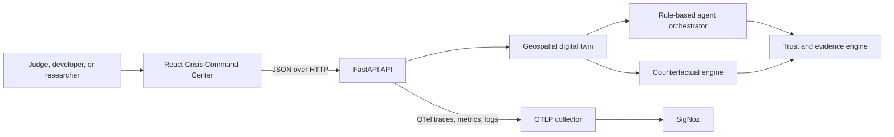

# GeoTwin Sentinel

> **Agentic Digital Twin for Healthcare Infrastructure Resilience**


[](LICENSE)


An observable, agentic geospatial digital twin for exploring healthcare infrastructure resilience under compound climate, infrastructure, cyber, and telemetry disruptions. GeoTwin Sentinel models a synthetic regional hospital network, exposes evidence-linked agent recommendations, compares bounded counterfactual interventions, and emits traces, metrics, and logs for audit in SigNoz.

> **Safety boundary:** Research decision-support prototype using synthetic data. Outputs are simulated estimates intended for authorized human review and are not clinical, cybersecurity, transfer, infrastructure-control, or emergency-response instructions.

**Live demo:** Pending public deployment verification · **Demo video:** Pending recording · [Three-minute script](docs/demo/demo-script.md) · [Documentation map](docs/README.md) · [Limitations](docs/research/limitations.md)

## Why it exists

A regional disruption rarely stays in one system. Extreme weather can affect power, demand, referral capacity, cyber defenses, and the telemetry used to understand the event. A conventional dashboard reports signals; GeoTwin Sentinel runs a bounded synthetic experiment that connects those signals to a hospital dependency graph, records how each agent reached its recommendation, tests interventions against the same baseline, and makes uncertainty and human-review requirements visible.

## What is implemented

- Three deterministic compound-disruption scenarios and a five-hospital synthetic DFW catalog.
- A FastAPI digital-twin engine with hazard, demand, cyber-loss, dependency, capacity, risk, resilience, and transfer calculations.
- A React/TypeScript Crisis Command Center with MapLibre GIS, hospital details, accessible tabular fallbacks, and session run history.
- Compound Event Detector, Telemetry Integrity Agent, Resilience Planning Agent, and a Response Orchestrator record.
- Counterfactual intervention transformations, outcome comparison, hospital/transfer diffs, and user-adjustable ranking priorities.
- Versioned trust calculation, evidence inventory and lineage, policy checks, anomaly warnings, and explicit human review.
- OpenTelemetry traces, metrics, structured logs, trace correlation, and optional OTLP export to SigNoz.
- Container, Render, Vercel, CI, smoke-test, and production-configuration validation.

## Scenarios

| Scenario | Compound pressure | Best demo emphasis |
|---|---|---|
| [Flood Grid Cascade](docs/scenarios/flood-grid-cascade.md) | Flooding, grid outage, regional capacity pressure | Dependencies, backup power, transfers |
| [Heatwave Ransomware](docs/scenarios/heatwave-ransomware.md) | Heat/air quality, demand surge, ransomware | Overload, segmentation, surge capacity |
| [Wildfire + Telemetry Tampering](docs/scenarios/wildfire-telemetry-tampering.md) | Smoke, manipulated and missing telemetry | Trust degradation, verification, human review |

Wildfire + Telemetry Tampering is the primary judge demo because one run connects physical hazard, cyber evidence quality, security-agent behavior, trust policy, counterfactual telemetry verification, and a traceable execution path.

## How it works



The API loads packaged synthetic catalogs, evaluates a request without external data calls, and stores completed baselines in bounded process-local memory for trust and counterfactual lookup. The browser stores only current-session presentation history. Restarting the API invalidates prior simulation IDs. See [system architecture](docs/architecture/system-architecture.md), [data flow](docs/architecture/data-flow.md), and [deployment architecture](docs/architecture/deployment.md).

### Agent and trust workflow

The detector assesses compound pressure; the integrity agent constrains recommendations when evidence quality is low; the planning agent proposes bounded regional actions; and the response orchestrator assembles records for review. These are deterministic rule-based agents. The trust engine scores evidence completeness, telemetry integrity, geographic coverage, freshness, consistency, provenance, policy compliance, uncertainty, and agent reliability using calculation version `geotwin-trust-v2.0`. Lineage is metadata-based and is **not** cryptographic provenance. [Agent details](docs/architecture/agent-orchestration.md) · [Trust model](docs/architecture/trust-model.md)

### Counterfactual reasoning

The explorer reruns the same evaluator after bounded transformations such as network segmentation, backup power, surge capacity, ambulance rerouting, or telemetry verification. It compares outcomes to the stored baseline and ranks completed candidates. Changing ranking weights changes prioritization, not simulated outcomes. Results are model estimates, not validated causal effects. [Counterfactual API and model](docs/api/counterfactual-api.md)

### Observability

FastAPI requests, digital-twin execution, agents, trust evaluation, and counterfactual evaluation emit OpenTelemetry. The UI displays a simulation trace ID and can link to a configured read-only SigNoz dashboard. Export failure is fail-open: it should not block simulation, but it reduces auditability. [Observability guide](docs/architecture/observability.md) · [SigNoz setup](docs/guides/signoz-setup.md)

## Technology

React 19, TypeScript, Vite, MapLibre GL, FastAPI, Pydantic, NetworkX, OpenTelemetry, pytest, Vitest, Ruff, Docker, Render, Vercel, and SigNoz.

## Quick start

Prerequisites: Git, Python 3.11+ (CI/container uses 3.12), and Node.js 20 with npm. From the repository root:

```bash
python3 -m venv .venv
source .venv/bin/activate          # Windows PowerShell: .venv\Scripts\Activate.ps1
python -m pip install -e '.[dev]'
cp apps/api/.env.example apps/api/.env
uvicorn app.main:app --app-dir apps/api --reload --host 127.0.0.1 --port 8000
```

In a second terminal:

```bash
cd apps/web
npm ci
cp .env.example .env.local         # Windows: copy .env.example .env.local
npm run dev -- --host 127.0.0.1 --port 5173
```

Open `http://127.0.0.1:5173`. API documentation is at `http://127.0.0.1:8000/docs` in local/test mode. For one-command container startup, run `docker compose up --build`; the UI remains a separate Vite process unless deployed. Full instructions: [local development](docs/guides/local-development.md).

## Configuration

Copy the scoped examples; never commit populated `.env` files.

- Backend: `APP_ENV`, `APP_VERSION`, `LOG_LEVEL`, `CORS_ALLOWED_ORIGINS`, `TRUSTED_HOSTS`, `MAX_REQUEST_BODY_BYTES`, `OTEL_ENABLED`, `OTEL_SERVICE_NAME`, `OTEL_EXPORTER_OTLP_ENDPOINT`, `OTEL_EXPORTER_OTLP_INSECURE`, `OTEL_EXPORTER_OTLP_HEADERS`, `OTEL_RESOURCE_ATTRIBUTES`.
- Browser-public: `VITE_APP_ENV`, `VITE_APP_VERSION`, `VITE_DEPLOYMENT_NAME`, `VITE_API_BASE_URL`, `VITE_MAP_STYLE_URL`, `VITE_SIGNOZ_DASHBOARD_URL`.

Only `VITE_*` values enter the browser bundle; they must never contain ingestion keys or secrets. See [configuration tables](docs/guides/local-development.md#environment-configuration).

## Run a simulation

```bash
curl --fail-with-body -X POST http://127.0.0.1:8000/api/v1/simulations/run \
  -H 'Content-Type: application/json' \
  --data @scenarios/wildfire-telemetry.json
```

Copy the returned `simulation_id` to query `/api/v1/trust/{simulation_id}` or submit a counterfactual comparison. Tested examples are in the [API overview](docs/api/overview.md).

## Test and validate

```bash
ruff check .
pytest
cd apps/web
npm run lint
npm run typecheck
npm test -- --run
npm run build
```

Deployment smoke tests and external-service requirements are documented in [testing](docs/guides/testing.md). CI also scans common secret patterns and validates a non-root container.

## Deployment

The implemented reference topology is a Vercel static frontend, one Render container worker, and optional SigNoz Cloud export. Public URLs are not committed and remain pending manual provider deployment/verification. See [cloud deployment](docs/guides/cloud-deployment.md), [release checklist](docs/RELEASE_CHECKLIST.md), and [demo recovery](docs/demo/demo-recovery.md).

## Repository map

```text
apps/api/       FastAPI routes, models, simulation, agents, trust, telemetry
apps/web/       React command center, GIS, agent, counterfactual, trust views
data/           Synthetic hospital GeoJSON catalog
scenarios/      Deterministic synthetic scenario request documents
observability/  Local OpenTelemetry Collector configuration
tests/          Backend unit and API integration tests
docs/           Demo, architecture, API, guides, scenarios, and research docs
scripts/        Secret and deployment smoke checks
```

## Research contribution and limits

The artifact offers an integrated testbed for studying compound infrastructure disruption, evidence-dependent agent confidence, telemetry-integrity effects, human-review policy, counterfactual prioritization, and observability as an audit mechanism. Automated tests demonstrate functional behavior and scenario sensitivity; they do not constitute clinical, operational, causal, security, or human-factors validation. See [research positioning](docs/research/research-positioning.md), [evaluation framework](docs/research/evaluation-framework.md), [threat model](docs/research/threat-model.md), and [limitations](docs/research/limitations.md).

## Roadmap

Planned work includes persistent experiments, probabilistic uncertainty and Monte Carlo comparisons, calibrated data adapters, policy-constrained planning, stronger injection defenses, cryptographic evidence provenance, privacy-preserving telemetry, multi-region models, benchmark artifacts, and expert evaluation. [Future work](docs/research/future-work.md)

## Contributing, security, and license

Contributions are welcome under [CONTRIBUTING.md](CONTRIBUTING.md) and [CODE_OF_CONDUCT.md](CODE_OF_CONDUCT.md). Report vulnerabilities according to [SECURITY.md](SECURITY.md), never with patient data or facility exploit details in a public issue. Licensed under [Apache-2.0](LICENSE).

## Acknowledgements

Built with open-source geospatial, API, graph, observability, testing, and web tooling. Map rendering uses MapLibre and a configurable public style provider; OpenTelemetry supplies vendor-neutral telemetry and SigNoz is the reference analysis backend.
