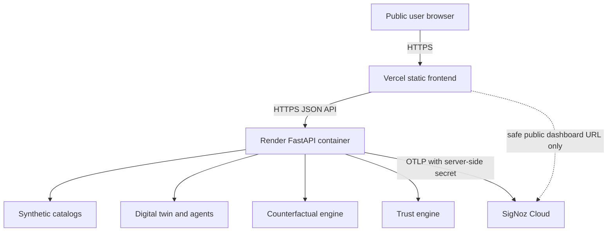

# Cloud deployment and release guide

GeoTwin Sentinel is a synthetic-data research prototype, not a production healthcare system. The primary deployment path is a Vercel static frontend, a single-worker Render API container, and SigNoz Cloud via server-side OTLP credentials.

## Architecture



The browser never receives OTLP endpoints, ingestion headers, Render credentials, or deployment tokens. HTTPS is terminated by Vercel and Render. The API is public for hackathon use; there are no administrative mutation endpoints and all request models are bounded.

## Environment model

`APP_ENV` and `VITE_APP_ENV` accept only `local`, `test`, `staging`, or `production`. Production and staging require explicit API/CORS configuration and reject localhost origins.

Backend public configuration:

| Variable | Required in production | Purpose |
|---|---:|---|
| `APP_ENV` | yes | Environment validation and OTel resource label |
| `APP_VERSION` | yes | Safe version returned by `/api/v1/meta` |
| `LOG_LEVEL` | yes | stdout logging level |
| `CORS_ALLOWED_ORIGINS` | yes | Explicit comma-separated frontend origins |
| `TRUSTED_HOSTS` | yes | Render/custom API hostnames |
| `MAX_REQUEST_BODY_BYTES` | no | Defaults to 1 MiB |
| `OTEL_ENABLED` | no | Fail-open telemetry switch |
| `OTEL_SERVICE_NAME` | yes when OTel is enabled | Stable service name |
| `OTEL_EXPORTER_OTLP_ENDPOINT` | yes when OTel is enabled | SigNoz OTLP endpoint |
| `OTEL_EXPORTER_OTLP_INSECURE` | yes when OTel is enabled | Must be `false` for SigNoz Cloud |
| `OTEL_RESOURCE_ATTRIBUTES` | no | Non-secret resource labels |

Backend secret, configured only in Render's secret environment UI:

- `OTEL_EXPORTER_OTLP_HEADERS`: SigNoz ingestion authorization. Rotate it in SigNoz, update Render, redeploy, and revoke the previous value.

Browser-public Vercel configuration:

| Variable | Purpose |
|---|---|
| `VITE_APP_ENV` | `staging` or `production` |
| `VITE_APP_VERSION` | Git SHA or release tag |
| `VITE_DEPLOYMENT_NAME` | Public deployment label |
| `VITE_API_BASE_URL` | Public HTTPS Render API origin |
| `VITE_MAP_STYLE_URL` | Public MapLibre style; default is OpenFreeMap |
| `VITE_SIGNOZ_DASHBOARD_URL` | Optional public/read-only dashboard URL |

Never put OTLP headers, cloud tokens, database passwords, or private URLs in `VITE_*` variables.

## Primary deployment: Render and Vercel

1. Push the reviewed branch and require the `backend`, `frontend`, and `security-and-container` CI jobs.
2. In Render, create a Blueprint from `render.yaml`. Set `APP_VERSION`, `CORS_ALLOWED_ORIGINS`, `OTEL_EXPORTER_OTLP_ENDPOINT`, and secret `OTEL_EXPORTER_OTLP_HEADERS`. Keep one worker: simulation lookup is process-local.
3. Confirm `https://<render-host>/api/v1/health`, `/ready`, `/health/observability`, and `/meta` return safe JSON.
4. Import the repository into Vercel. `vercel.json` builds `apps/web` and serves SPA fallbacks and security headers.
5. Set the six browser-public variables above. Use the exact Vercel origin in Render `CORS_ALLOWED_ORIGINS`.
6. Deploy Vercel, then run:

```bash
BACKEND_URL=https://api.example.org \
FRONTEND_URL=https://demo.example.org \
EXPECTED_FRONTEND_ORIGIN=https://demo.example.org \
python scripts/smoke_test.py
```

Platform Git integration is the only deployment mechanism: pull requests run CI; merges to the configured main branch deploy. Render and Vercel environment secrets are not copied into GitHub Actions. For a stricter release flow, disable auto-deploy and promote a CI-green tagged commit manually in both platforms.

## Local production parity

```bash
cp .env.example .env
docker compose up --build -d
cd apps/web
npm ci
VITE_APP_ENV=test \
VITE_API_BASE_URL=http://127.0.0.1:8000 \
VITE_APP_VERSION=local-smoke \
npm run build
npm run preview -- --host 127.0.0.1 --port 4173
```

In another terminal:

```bash
BACKEND_URL=http://127.0.0.1:8000 \
FRONTEND_URL=http://127.0.0.1:4173 \
EXPECTED_FRONTEND_ORIGIN=http://localhost:4173 \
SMOKE_ALLOW_LOCALHOST=true \
python scripts/smoke_test.py
```

The local test build intentionally permits HTTP for parity. Staging and production use explicit non-local origins; production requires HTTPS.

## Health, startup, and resource behavior

- `/health` is liveness and does not depend on SigNoz (`/api/v1/health` is retained for clients).
- `/ready` verifies packaged synthetic hospital and scenario catalogs (`/api/v1/ready` is also available).
- `/health/observability` reports enabled/configured state without endpoints or headers (also under `/api/v1`).
- `/api/v1/meta` exposes only environment, version, service, synthetic mode, and persistence type.
- Uvicorn binds `0.0.0.0:$PORT`, runs one worker, disables reload/access logging, and allows 15 seconds for graceful shutdown and telemetry flushing.
- No startup simulation, database connection, or external seed download occurs. Free-tier cold starts may take tens of seconds; the frontend retains useful error/retry states.

## CORS, headers, maps, and domains

CORS allows only configured origins, `GET`/`POST`/`OPTIONS`, and the content and W3C trace headers used by the application. Credentials are disabled. Add both Vercel preview/staging and production origins explicitly; do not use `*`.

Vercel sets CSP, HSTS, anti-framing, content-type, referrer, and permissions headers. CSP permits HTTPS API/map resources and WebGL blob workers. OpenFreeMap is a public external dependency; availability is not guaranteed, attribution remains provided by MapLibre, and the existing accessible facility fallback remains usable.

For a custom domain, configure a frontend `CNAME`/provider record and an API subdomain in Render, wait for managed TLS, then update `VITE_API_BASE_URL`, `CORS_ALLOWED_ORIGINS`, `TRUSTED_HOSTS`, CSP if narrowed, and smoke-test both old and new URLs before removing the old domain.

## SigNoz validation

Configure the SigNoz Cloud OTLP endpoint and ingestion header only on Render. Verify a scenario trace ID in the UI, then query SigNoz for service `geotwin-api`, the deployed environment, simulation spans, trust spans, custom risk/integrity metrics, and structured agent/trust logs. Telemetry authentication or export failure must not fail health or simulations. Alert delivery is not configured by this repository; manually configure and test API availability, latency, simulation/agent failures, human-review rate, trust degradation, exporter failure, and missing telemetry alerts before claiming them operational.

## Rollback and recovery

1. Identify the first unhealthy version from `/meta`, Render events, Vercel deployment history, and correlated SigNoz traces.
2. Select the prior CI-green Git commit/deployment in both providers.
3. Use Render **Rollback/Redeploy** for that commit and Vercel **Promote to Production** for its paired frontend deployment. No zero-downtime claim is made.
4. Revert environment changes separately using the platform audit/history record; never paste secrets into Git.
5. Verify health, readiness, metadata version, CORS, deep links, one scenario, counterfactual lookup, trust lookup, and telemetry correlation.

Because storage is process-local, recovery is redeployment from Git plus restoration of documented environment variables. Existing simulation IDs are expected to expire on rollback/restart.

## Failure guide

| Symptom | Likely cause | Recovery |
|---|---|---|
| Build/install failure | lock/runtime mismatch | reproduce CI with Python 3.12 and Node 20; fix before deploy |
| Health failure | wrong `PORT`, host, image, or catalog | inspect Render logs and `/ready`; redeploy prior image |
| Browser configuration error | missing/invalid `VITE_API_BASE_URL` | set an absolute HTTPS origin and rebuild |
| CORS rejection | origin absent or malformed | add exact scheme/host, redeploy API, run preflight smoke test |
| OTLP errors | endpoint/header/TLS mismatch | rotate/check server-side secret; simulation remains available |
| Map failure | style/CSP/tile outage/WebGL | validate public style and CSP; use accessible fallback |
| Deep-link 404 | host rewrite missing | validate `vercel.json`, then redeploy frontend |
| Counterfactual baseline missing | restart, second worker, or different replica | run a new simulation; keep one worker for demo |
| Cold-start timeout | free-tier suspension | retry after health succeeds or choose a paid always-on instance |
| Memory restart | platform limit or load | inspect metrics, reduce concurrency, or select a larger plan |

## Security and abuse posture

Requests are schema-bounded, counterfactual candidates are capped, body size is capped at 1 MiB, exceptions are controlled, production docs are disabled, containers are non-root, and secrets are not logged or returned. Public demo endpoints are unauthenticated and application-level rate limiting is deferred; use Render/provider protection if abuse appears. There is no raw patient data, command execution, arbitrary file access, admin API, or autonomous authorization.

CI performs tests, lint/type checks, a production frontend build, a lightweight tracked-file secret scan, a non-root Docker build/start/health check, and a backend smoke test. Dependency and container advisory reviews should be performed at release time; critical fixable vulnerabilities and confirmed secrets block release.

## Optional alternative

Cloudflare Pages plus Google Cloud Run is a coherent alternative for stronger edge hosting and container autoscaling. It is not implemented because multiple Cloud Run replicas would require external persistence or a sticky comparison design for current simulation IDs. If adopted, first move baseline storage to a shared bounded store, then translate the same environment, CORS, health, and single-source release controls.

## Known limitations

- Free-tier cold starts and no uptime guarantee.
- Process-local history is lost on restart/redeploy and is unsuitable for multiple workers/replicas.
- No authentication, application rate limiter, database, multi-region failover, backup SLA, or disaster-recovery SLA.
- Public tile and SigNoz retention depend on external services and selected plans.
- No real hospital data, clinical validation, regulatory certification, or healthcare production readiness.
- Cloud URLs, live SigNoz receipt, and provider rollback require manual credentials and verification outside the repository.
