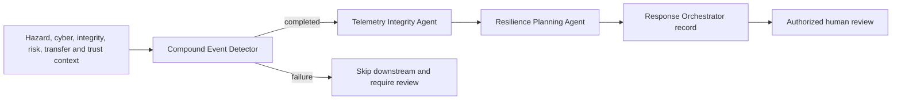

# Agent orchestration

The “agents” are implemented deterministic Python decision components, not language models and not autonomous controllers.

| Agent | Inputs | Outputs/categories | Evidence | Failure/review behavior | Span |
|---|---|---|---|---|---|
| Compound Event Detector | Hazard pressure, cyber severity | `observe` or `escalate`; confidence and explanation | Compound hazard, regional risk | Escalation warns; failure skips later agents | `agent.execute` |
| Telemetry Integrity Agent | Telemetry-integrity score | `continue-with-provenance` or `quarantine-and-require-human-review` | Integrity, missingness, tampering | Integrity below 0.65 requires review | `agent.execute` |
| Resilience Planning Agent | Regional risk, transfer count, trust confidence | `maintain-readiness` or `activate-regional-load-balancing` | Regional risk, hazard pressure | Elevated action requires review; recommendations remain bounded | `agent.execute` |
| Response Orchestrator | Completed records and regional risk | Coordinate, observe, or defer record | Regional risk, integrity | Any component failure defers; elevated risk flags review | Response record; no independent `agent.execute` span |

Every execution record can include sequence, stage, status, action, confidence, explanation, evidence IDs, times, duration, review flag, warning/error, and trace/span identifiers. Confidence is rule-derived and is not empirically calibrated. Agents do not call external tools, execute recommendations, dispatch ambulances, or modify infrastructure. Future probabilistic or policy-planning agents must be documented as planned until implemented.
