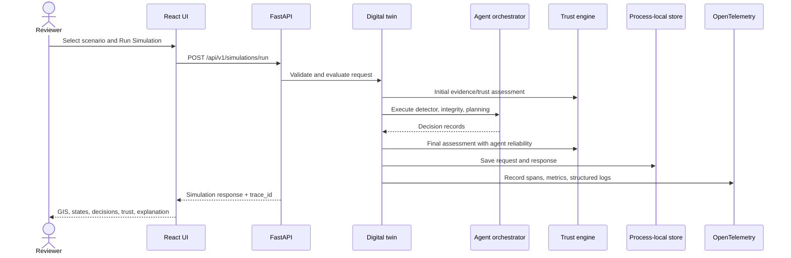

# Data flow

Scenario JSON is both the catalog source and the request shape delivered by the browser. Hospital GeoJSON supplies identifiers, coordinates, capacities, dependencies, and referral neighbors. Calculations use only these synthetic packaged inputs. Counterfactual calls reference the stored simulation UUID, transform a copy of its original request, rerun the same evaluator, and compare it with the exact stored response.

No patient records, user identity, browser fingerprint, or personal analytics enter this flow. Standard server access logs may contain request paths; production container access logging is disabled by default.
