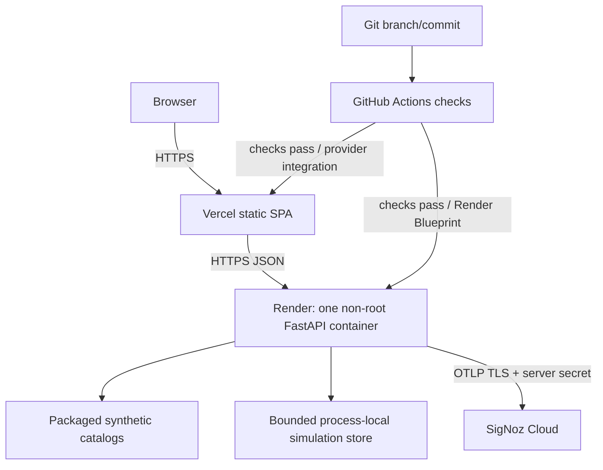

# Deployment architecture

`render.yaml`, `vercel.json`, and the production `Dockerfile` implement this reference architecture. The single worker is deliberate because baselines are process-local. Vercel performs SPA deep-link rewrites and adds browser security headers. Render terminates HTTPS and runs UID 10001. Provider credentials, OTLP headers, and deployment actions remain outside Git.

No public URLs have been verified from this repository state. No uptime, zero-downtime, backup, multi-region, autoscaling, or disaster-recovery claim is made. Operational steps are in [cloud deployment](../guides/cloud-deployment.md).
