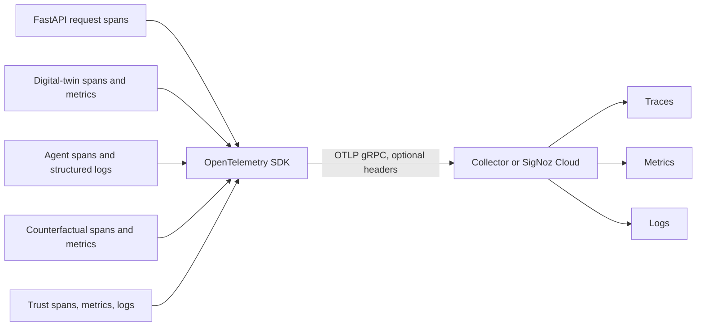

# Observability architecture

`OTEL_ENABLED=false` disables SDK export for a dependency-free local demo. With export enabled, service resources include name, application version, and deployment environment. Simulation responses expose a W3C-derived `trace_id` when a valid recording context exists. Agent records expose child span IDs where available. The UI may open `VITE_SIGNOZ_DASHBOARD_URL`; it never receives ingestion credentials.

Useful filters include service `geotwin-api`, scenario/simulation attributes, `digital_twin.run`, `agent.execute`, trust calculation spans, counterfactual spans, and error status. Exact available attributes are listed in [OTel conventions](../OTEL_SEMANTIC_CONVENTIONS.md). Export is fail-open, so `/health` can remain healthy while `/health/observability` reports disabled or incomplete configuration. Delayed/missing telemetry must be disclosed during a demo rather than treated as proof of no error.
