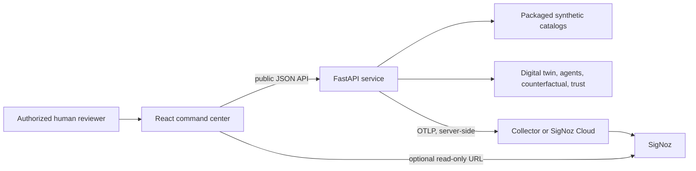
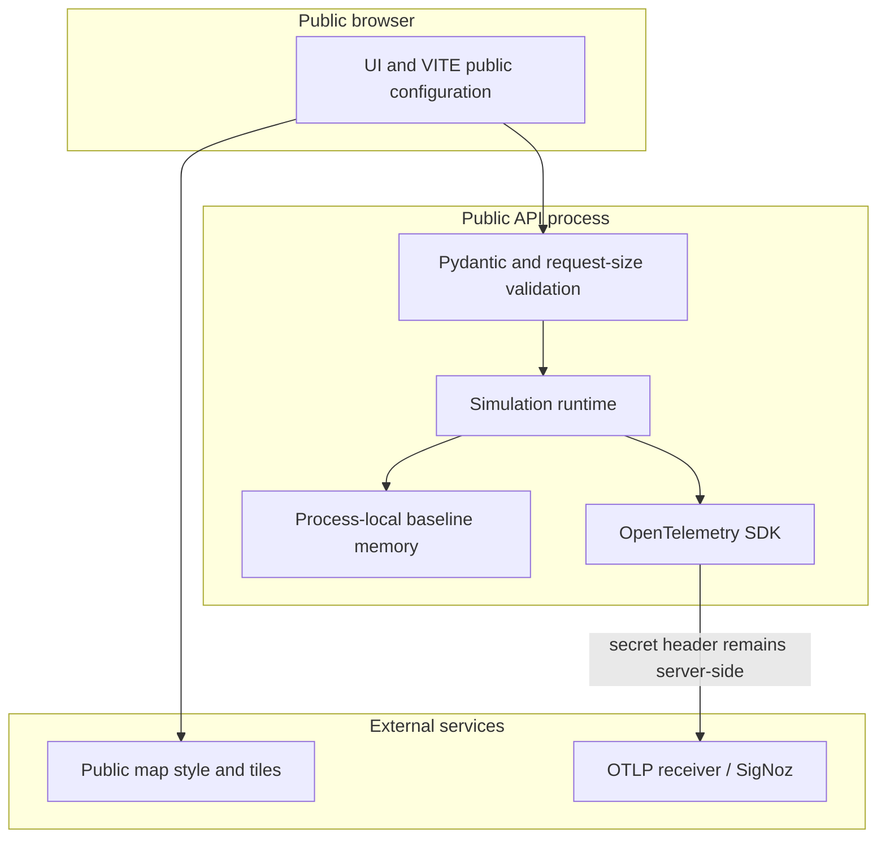

# System architecture

## Context

## Components

| Component | Actual responsibility | Failure behavior |
|---|---|---|
| React/Vite frontend | Catalog selection, run state, GIS/table presentation, agent/trust/counterfactual interaction | Shows loading, empty, partial, and error states; map has tabular fallback |
| FastAPI API | Validation, endpoint orchestration, health/metadata, response serialization | Controlled HTTP errors; 1 MiB default body limit; telemetry fails open |
| Catalog services | Load five synthetic hospitals and three JSON scenarios from packaged files | Readiness fails if catalogs cannot load |
| Digital twin | Deterministic graph/state calculations for a request | Rejects unknown target hospital; no external runtime feeds |
| Agent orchestrator | Sequentially executes three rule-based agents and assembles a meta record | Agent exception becomes a failed record; detection failure skips downstream agents |
| Counterfactual engine | Re-evaluates transformed requests against a stored baseline | Individual candidate failure is isolated; missing baseline returns 404 |
| Trust engine | Versioned factors, evidence lineage, policies, review reasons, anomalies | Safe fallback lowers confidence and requires review |
| Process-local store | Bounded lookup for recent simulations | Lost at restart; incompatible with multiple independent workers |
| OpenTelemetry | Request/domain spans, metrics, logs, trace IDs | Export problems do not block core results |

## Trust boundaries

The public demo has no authentication or application rate limiter. Browser variables are public. OTLP headers are server-only. Inputs are schema-bounded synthetic experiment parameters, not arbitrary prompts or tools.

## State and limitations

The API is computationally deterministic for the same request, aside from UUIDs, timestamps, durations, and trace identifiers. It has no database, event stream, real hospital integration, background job system, or shared cache. The map depends on an external tile service. See [limitations](../research/limitations.md).
