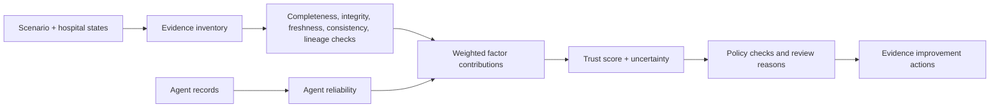

# Trust and evidence model

Trust calculation version `geotwin-trust-v2.0` converts explicit synthetic evidence-quality signals into an auditable decision-support score. It does not certify truth or safety.

| Dimension | Weight | Meaning in this implementation |
|---|---:|---|
| Evidence completeness | 0.18 | Expected scenario/hospital signals present |
| Telemetry integrity | 0.22 | Rule-based missingness and tampering assessment |
| Geographic coverage | 0.08 | Catalog coverage represented by evaluated hospitals |
| Freshness | 0.08 | Current synthetic observation timestamps |
| Consistency | 0.10 | Conflicting-evidence penalties |
| Provenance | 0.10 | Basic source and parent-ID lineage metadata |
| Policy compliance | 0.10 | Transfer constraints and review policy checks |
| Agent reliability | 0.14 | Completion/status and confidence of agent records |

The service records raw factor value, normalized value, contribution, weight, explanation, and evidence IDs. Recommendation confidence is constrained by weighted trust and uncertainty. Integrity bands are derived from rule thresholds; anomaly records are deterministic validation findings, not machine-learning anomaly detection.

Evidence records include a source/source ID, signal/value/unit, reliability, confidence, integrity/provenance/freshness status, timestamps, scope, hospital/scenario IDs, dependent agent IDs, parent evidence IDs, warnings, and validation checks. This is **evidence lineage**, not a signature, immutable audit ledger, cryptographic provenance, or external attestation.

Human review is mandatory when policy rules, evidence integrity, uncertainty, agent status, transfer safety, or elevated recommendations warrant it. Review is a UI and response policy flag; the prototype has no identity, approval workflow, or enforcement integration. See [threat model](../research/threat-model.md) and [limitations](../research/limitations.md).
